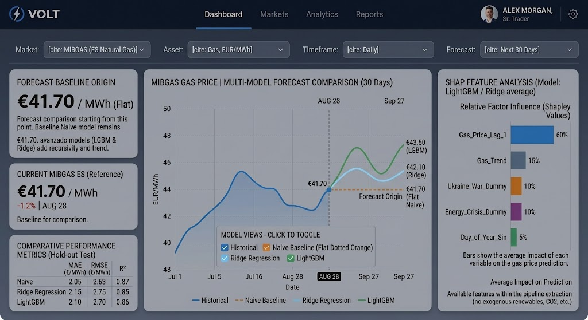

# 05_diseno_frontal.md

## 1. Resumen de la solución y del usuario
*   **Problema:** La extrema volatilidad de los precios del gas natural (MIBGAS), que impide una planificación logística y presupuestaria fiable.
*   **Usuario principal:** Gestor de *trading* energético o analista de compras.
*   **Necesidad:** Anticipar el precio diario del gas a 30 días vista comparando proyecciones algorítmicas frente a la inercia del mercado.
*   **Tipo de producto:** *Dashboard* analítico, comparador de modelos y predictor operativo.
*   **Acción principal:** Decidir si adelantar compras o aplicar coberturas (*hedging*) basándose en la evaluación objetiva de múltiples algoritmos (Naive, Ridge, LightGBM) y la explicabilidad de sus factores.

## 2. Imagen mockup del frontal

## 3. Justificación del diseño

### 3.1. Utilidad y valor de la solución
El *dashboard* centraliza la estimación del mercado a 30 días huyendo del concepto de "caja negra" o predicción única e infalible. Su mayor valor reside en empoderar al usuario mediante la comparación: ancla las expectativas en una línea base robusta (Modelo Naive) y permite superponer algoritmos de *Machine Learning* (Ridge y LightGBM) para evaluar visual y matemáticamente si la complejidad algorítmica aporta valor real o sufre degradación (*drift*) a largo plazo. 

### 3.2. Flujo de usuario
1.  **Punto de entrada:** El usuario visualiza el último precio real de MIBGAS y las métricas de rendimiento en *backtesting* (MAE, RMSE, R²) de los tres modelos disponibles.
2.  **Selección y Comparación (Toggle):** Utilizando el panel interactivo bajo la gráfica, el usuario activa o desactiva las predicciones de los modelos para comparar visualmente la tendencia plana (Naive) frente a las curvas de regresión (LightGBM/Ridge).
3.  **Explicabilidad:** Consulta el panel lateral derecho (SHAP) para entender qué variables exactas del *pipeline* (retardos, tendencias, dummies geopolíticas) están impulsando las predicciones de los modelos complejos.
4.  **Acción:** Ejecuta la estrategia de compra fundamentando su decisión en el modelo que ofrezca el mejor balance entre métricas de error y coherencia visual en el escenario actual.

### 3.3. Experiencia de usuario
*   **Jerarquía visual e interactividad:** El gráfico multilínea domina el centro, pero delega el control en el usuario mediante selectores (*checkboxes*) simples para evitar la sobrecarga visual si solo desea consultar una proyección.
*   **Transparencia analítica:** A diferencia de diseños anteriores, se exponen abiertamente las métricas de evaluación empírica (RMSE, MAE, R²) en una tabla compacta inferior, dotando al *trader* de las herramientas estadísticas necesarias para auditar la fiabilidad de las proyecciones.
*   **Contexto y realismo:** Se elimina cualquier falsa sensación de certeza probabilística (como bandas de confianza ficticias), mostrando proyecciones deterministas claras.

## 4. Presentación de resultados y explicabilidad
El frontal presenta proyecciones a 30 días deterministas e independientes para cada arquitectura. Para evitar sesgos de automatización, el panel de "Influencia" aloja los resultados de interpretabilidad **SHAP** calculados sobre los modelos complejos (LightGBM/Ridge). Muestra de forma transparente el peso de las características realmente procesadas por el sistema (como `Gas_Price_Lag_1` o `Gas_Trend`), demostrando empíricamente cómo el mercado absorbe el histórico inmediato.

*Uso de IA Generativa:* No se implementará IA generativa. En un mercado hipervolátil que exige rigor cuantitativo, el usuario requiere trazabilidad matemática absoluta, proporcionada exclusivamente por los Valores de Shapley.

## 5. Alcance real del MVP (Ajuste a la realidad analítica)
El diseño presentado refleja con exactitud las capacidades funcionales y matemáticas del Producto Mínimo Viable (MVP) desarrollado en los scripts del proyecto, garantizando una honestidad técnica total:

*   **Sincronización total con el *pipeline*:** Todos los elementos visualizados en el frontal están respaldados por el código. El sistema compara el **Modelo Naive** (generado directamente como extensión de la última observación) con los resultados de inferencia de **LightGBM** y **Ridge Regression** entrenados previamente. 
*   **Métricas y variables fidedignas:** La tabla comparativa refleja los resultados de la evaluación estricta (*Hold-out Test* / *Backtesting*), y el panel lateral de SHAP utiliza únicamente las variables de ingeniería de características presentes en el archivo `dataset_final.csv`. Se han descartado proyecciones irreales y variables exógenas (almacenamiento físico, renovables) que no forman parte de la arquitectura del TFM.